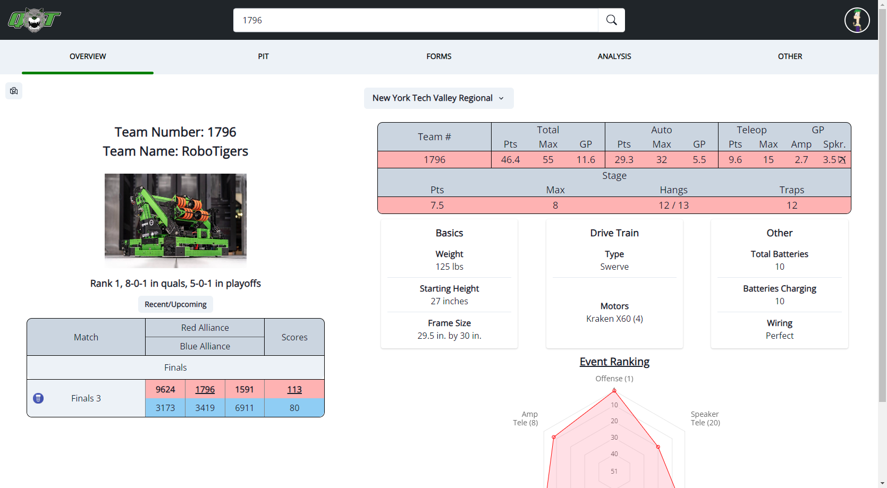

# FRC Scout 2024

### DEPLOYED URL: https://scout.robotigers1796.com
### SRS Document Link: [2023 Whitepaper](https://github.com/DanielLaszczych/FRCScout2024/blob/main/2023%20Scouting%20Whitepaper.pdf)

## Summary
This is a website used for scouting for the 2024 FRC season. It includes data collection for pits and matches, where quantitive
and qualitative metrics are collected. A suite of tools on the website allows one to analyze a specific team,
upcoming match, or overall event. The website integrates Google OAuth to ease the burden of account management, with this we also
only allow accounts from our domain from being able to access the website.

It is built using the MERN stack. A key focus of the website is ensuring it is mobile friendly as a large sum of the users access
to website using a mobile device. Because of this fact, this website is also a PWA as we want to ensure we can still access to website
even when connectivity is limited.
	
## Features

### Home Page
The home page serves as the hub for scouters with key information being easily visible and any links to relevant pages being 
accessible. This page contains our team schedule for the event which is pulled from TBA API meaning it is always up-to-date ensuring 
we are always aware of our current standing and future matches. As mentioned previously, scouters can easily access any relevant pages
from the home page: pit scouting, stand scouting, and super scouting.

### Pit Scouting
Pit scouting primarily collects preliminary information on teams before matches have started. This gives us a general
estimate of a team's abilities so that we are still able to form strategies without having to wait for matches to start. In that sense, 
we collect more general information on a team such as the mechanisms of the robot or what their most reliable autonomous consists of. 
Of course, we also collect information one cannot obtain from a match such as weight, height, programming language, etc.

### Match Scouting
Match scouting is the key focus when it comes to any scouting application for FRC. Our match scouting page is broken into multiple sections 
to try to match the different parts of the match (Pre-Auto, Auto, Teleop, Endgame, and Closing). Each section contains the relevant data points
that we want to record during the portion of the match. The UI and UX are designed in such a way that a user can easily focus on watching their 
robot while still accurately collecting data. In that regard, users can also easily undo or redo changes and are always notified if
they are missing responses for something.

### Team Page
The team page contains an overall breakdown of a team including information from both pit scouting and match scouting. Additional information such
as upcoming matches, relevant performance compared to other teams, and a robot image is also included on this page. From this page, a user can also
access more specific information on a team such as all the data from pit scouting or match scouting, and even an analysis page where data is visualized
in the form of graphs and tables.

### Other Features
Match Analyst Page: Provides a general breakdown for each team in a match with predicted scores for each alliance  
RTESS Page: A page with useful features for the RTESS subgroup of our team which assists other teams  
Admin Page: A hub for admins to make any needed changes  
Data Extract: Allows data to be extracted to a CSV or Excel sheet  

## Technology Stack
	[React] - front-end library to create our user interface using functional components and hooks to 
	manipulate state information 
  
	[React-Router] - used to develop single-page web applications by allowing switching between
	routes specified by the URL. Users can redirect to different react components while saving state
	information
  
	[Chakra UI]  - front-end styling library to create simple, modular, and accessible components 
	using React 
  
  	[Node.JS] - Backend runtime environment for running a web server
    
	[Express] - Web application framework for Node that handles routing and HTTP requests
  
   	[Mongoose] - object data modeling library for MongoDB that is used to model your data using
	schemas 
  
	[MongoDB Atlas] - cloud-based NoSQL database that stores data in documents that employ a format
	similar to JSON
  
	[Passport] - a middleware for Node that takes care of authentication requests from an OAuth 
	providers such as Google or Facebook
  
  	[Cloudinary] - cloud-based API used to store images in the backend as links stored in MongoDB

